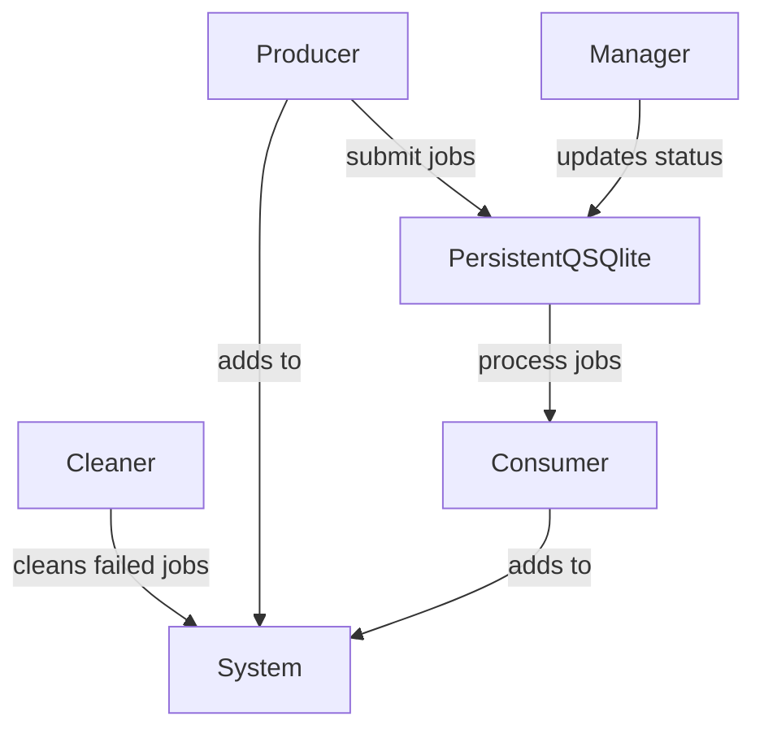

<h1>Assignment</h1>
Design a system with producer and a consumer.<br>
Producer produces some entities independent of consumer<br>
Consumer consumes the entities, producing new entities.<br>
Click <a href="#usage">here</a> for usage/commands.
<hr>
<h1>Solution</h1>
Here, let the job be a string of length 10.<br>

Processes are handled/run simultaneously using ```pm2```.




<h3>System</h3>
<p>
Consists of abstract class (<a href="https://docs.python.org/3/library/abc.html">ABC</a>) <b>PersistentQInterface</b>, children <b>Producer</b>, <b>Consumer</b>, <b>Cleaner</b> and <b>Manager</b>.<br>
Also consists of class <b>PersistentQSQLite</b> that performs SQL queries on a database from Python.<br>
<br>
On being called, <b>Producer</b> generates a file name (and file), and submits this file name as a job. <b>PersistentQSQLite</b> adds this name to a queue/SQL database. Occurs every <b>5</b> seconds<br>
<b>Consumer</b> reads this queue and processes them, generating a new file with the processed content. Occurs every <b>7-15</b> seconds.<br>
If after <i>n</i> tries a file is not able to be processed by <b>Consumer</b>, it gets renamed with a <i>.failed</i> extension. <b> Cleaner</b> checks for .failed files every <b>30</b> seconds and deletes them.<br>
<b>Manager</b> retrieves filenames with the status "processing" and the time passed since status application. If a file has been processing for more than <b>60</b> seconds, <b>Manager</b> will reassign it "unprocessed" status so it can be picked up by other Consumers.<br>
Wait times for Producers, Consumers, Cleaners and Managers are independent amongst themselves and each other.
</p>
<hr>
<h1 id="usage">Usage</h1>

```bash
atk-training-rin-q-basic --help
```

The program will open in ```localhost:8000```. From there, provide the path to config file (<b>absolute path</b>),
producer name and consumer name. Note that these fields CANNOT be empty, even if unused.<br><br>

Click on the appropriate buttons to start/end producers/consumers with the provided names.
<i>producer</i> and <i>consumer</i> will be running in the background -- any logs/output produced (primarily by
consumer) will be visible in the terminal. <br>
<b>NOTE: All files produced will be in the CURRENT DIRECTORY BY DEFAULT. To set your custom path, modify primary_path in
config.yaml.</b>

<h3> Setting up your own config</h3>
Parameters can be customised by giving the command path to a config.yaml file.<br>
The parameters along with their default values are as follows. If any parameter is missing from the file, the default value will be used.

```yaml
consumer:
    n_time: 3600
    n_tries: 3
general:
    primary_path: current/directory
```
```n_time``` : Seconds a consumer is allowed to spend on one job before skipping
```n_tries``` : Number of time a consumer is allowed to try a job (in case of errors) before skipping
```primary_path```: Path where files are created
